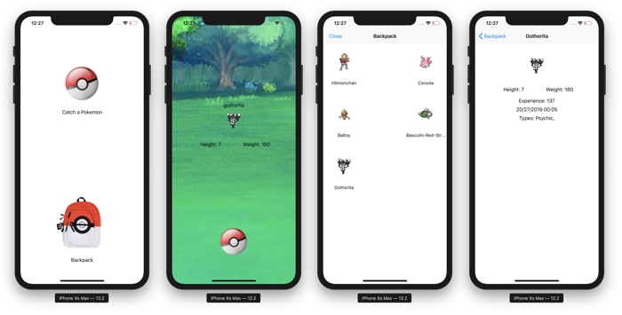
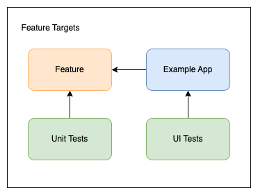
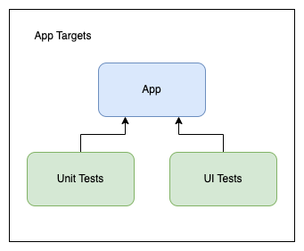
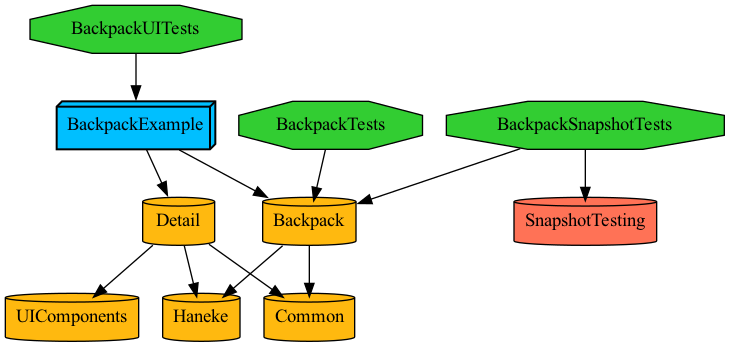
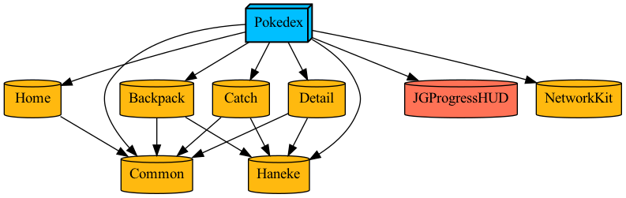
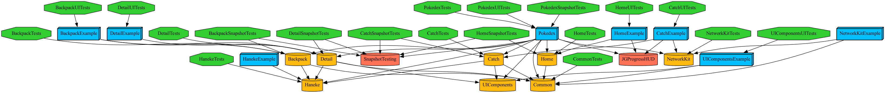

    

# Pokedex

 

This simple 4-screen iOS app is a Swift code example to demonstrate a micro-feature approach to modularisation based on Tuist, that fetches data from an [API](https://pokeapi.co), parses the response, displays some of the data, stores it locally, and can retrieve it. The networking module has implementations for both Combine and Async/Await. The aim was to keep this as simple as possible but follow best practices and standard design patterns. 

	- Home Scene
	- Catch the Pokemon Scene 
	- Backpack Scene
	- Details Scene

The Home scene has 2 buttons, the first opens the Catch scene, the latter opens the backpack scene. 

On tapping the first button, it will make a call to the API, and depending on the response, display a new Pokemon, inform the user that this can be caught or if it has already been caught, or an error and ask the user to try again. 

Choosing to catch the Pokemon will dismiss the screen, store the data to the file system, and return to the Home scene. 

Tapping on the lower button opens the Backpack scene, which displays all the caught Pokemons in a grid. Tapping on a Pokemon opens the Detail Scene and it provides more details in terms of properties and the date and time it was caught.

## Tuist

Running the code in this repo requires the prior installation of [tuist.io](https://tuist.io) version 3.19.0 and Xcode 14.2. First fetch the dependencies with `tuist fetch` and then generate the project and workspace by running [`tuist generate`](https://tuist.io/docs/usage/get-started/). It will automatically open the project in Xcode.

## Micro-Feature Architecture
										     
The project implements a simplified version of the micro-feature modular architectural pattern suggested by the Tuist team ([see here](https://docs.tuist.io/building-at-scale/microfeatures))							     
Each feature module has 5 targets: The framework target, a unit testing target, a snapshot testing target, an example app target, and a UI testing target.

    

The application target also has both unit test and UI testing targets.

    

Each scene is defined as a separate feature module (Home, Catch, Backpack and Detail), along with additional core modules for Common, UIComponents, Network, Haneke image library, and the main application. Tuist can generate a project that can focus on any one, or a combination of these modules, the testing targets, or the example application that validates each module. For example: 
`tuist generate Backpack BackpackTests BackpackSnapshotTests BackpackExample BackpackUITests`

The module dependencies are defined in such a way that no feature module depends on another, and none of the feature modules depend on external dependencies. The coordinator in the main application handles all the inter-feature module communications and the dependency inversion. 

Here's the graph for the Backpack feature module. 

    

Run `tuist edit` and view the Project.swift manifest to see the structure and how dependencies are defined and linked.

The dependency graph shows the example apps, the feature modules and the common shared module, along with the network and Haneke image library, as well as JGProgressHUD, which is loaded as an SPM.
 

    

The full graph includes all the testing targets. 

    

## Architecture 

    

At the root level, the application employs the [coordinator pattern](http://khanlou.com/2015/01/the-coordinator/) to remove the dependency between screens, enabling better reusability and testability. 

The presentation layer uses the well-known [Model-View-Presenter pattern](https://en.wikipedia.org/wiki/Model–view–presenter), giving a clean separation of concerns between the view, state and the data.

A wireframe structure is used to manage the dependency injection in the view controller and presenter.

The data provider class acts as a data access layer, which has extensions defined by protocols for each screen and the music player. This ensures that access to functions are restricted, and it facilitates unit and integration testing by mocking the data layer. It initiates calls to a networking service and receives a response.

An AppData class is used to maintain global state across screens, with the data provider controlling its access. View controllers have read-only access, and data must be updated via actions. This is a form of uni-directional data flow that helps prevent inconsistencies in the screens and the data presented. 

## Implementation 

The coordinator is in charge of what is displayed on the screen. It contains the code to display the screens, show loading HUD, or an alert message. 

It also receives call backs from the data provider when a request has completed its job, or an error has occurred. This in turn notifies the current scene to update or display an alert. 
 
## Manual & Automated Testing
The project has unit, snapshot and UI tests. There are comprehensive unit tests both at the feature and at the application level. Run `tuist test` to execute all the tests, or `tuist test <feature_name>` for running the tests on specific modules. The project also has 2 custom schemes (currently disabled) to help with manual validation: "UITesting" and "AsyncNetworkTesting". Each of these have the launch argument added. 

The [Snapshot Testing library](https://github.com/pointfreeco/swift-snapshot-testing) from PointFree is used for the main app, and feature modules. It is only a rudmentary implementation here to show how it can be done. 

## Circle CI
The project is integrated with Circle for continuous integration. Each push to a branch will trigger the build and test workflow. 

The configuration takes advantage of extensive caching on Circle as well as Tuist Cloud. It generates a checksum file and uses this as a key to access cached folders. 

### Testing
The output of the tests can be viewed by checking the artefacts section on a seccessful workflow. It uses XCResultParser to convert the output of the tests (XCResult - binary format) to the standard JUnit XML file format. The XCResultParser binary is added to the repo to save time downloading and compiling it every time because Homebrew can be quite slow even when the NO_AUTO_UPDATE=1. (It's painfully slow without that) 

### Downloadable Simulator Builds
Also the simulator application builds are there for download in the artefacts. The workflow does this by compressing the .app folder found in derived data but skipts the test runners. 

